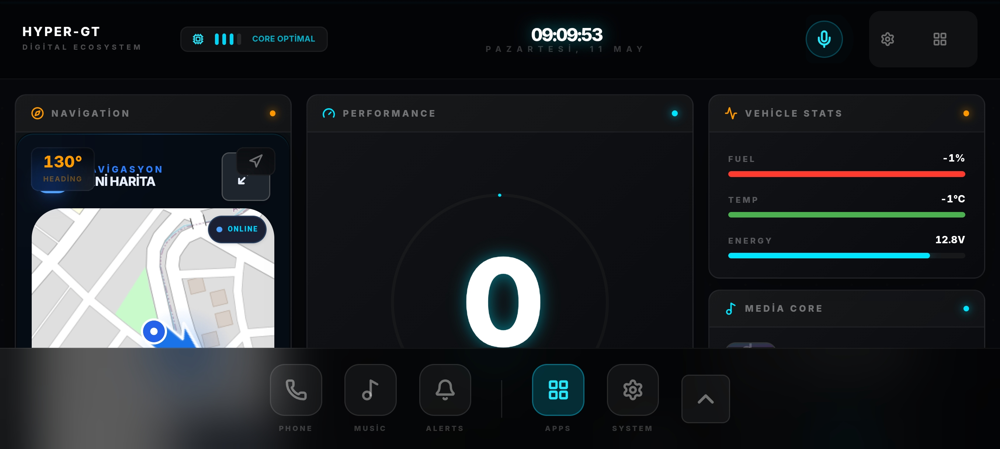
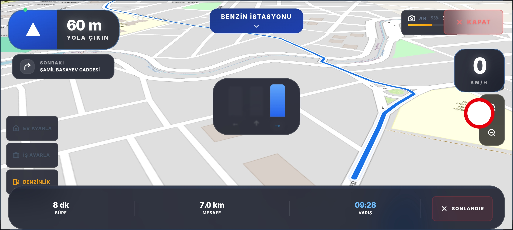
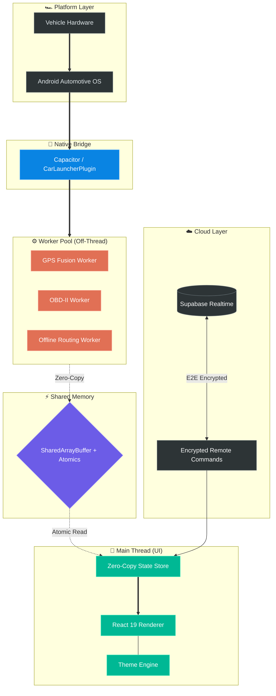

# CockpitOS Pro


CockpitOS Pro is an aftermarket **Vehicle Intelligence OS** — not a launcher, but the vehicle's *second brain*. Built for Android-based head units, it turns raw OBD-II / CAN telemetry into **decisions**: it validates, interprets, predicts, and acts on the driver's behalf. Unlike single-brand systems, it learns hundreds of *unknown* makes and models through confidence-driven, **zero-trust** sensor fusion — all while preserving deterministic performance and thermal stability on low-power hardware.

> **No data is read merely to be displayed. Every signal is part of a decision.**
> Adding a PID is not success — extracting *meaning* from it is.

---

## 📸 Screenshots


*Main dashboard — Navigation, Performance monitor, Vehicle Stats*


*Full-screen navigation — Turn-by-turn HUD, AR overlay, live routing*

---

## 🏎️ Vision & Philosophy

CockpitOS Pro is built to be the aftermarket answer to single-brand vehicle intelligence: a system that understands *any* car, not just one. It rests on two pillars — **Zero-Fluff Engineering** (every byte of memory and every CPU cycle is accounted for) and **Zero-Trust Telemetry** (no aftermarket signal is trusted blindly; every value carries a confidence score).

Because we read hundreds of unknown ECUs rather than one known platform, our intelligence must be *stronger* than a factory system — it has to earn trust from noisy data. Every signal passes an **8-gate decision contract**: *Is it true? Is it important? Should the user know? Should only the system know? What does it mean combined? What happens in 5 minutes? What can we decide for the driver? What is the right action now?*

- **Controlled Evolution** — stability invariants are non-negotiable; features ship on a performance budget
- **Performance-Adaptive Hybrid** — all intelligence layers on; each subscribes to a DeviceTier budget
- Deterministic UI with adaptive FPS targets (60 → 15) and graceful thermal degradation
- Safety-critical layers guaranteed on every hardware tier; heavy analysis stays cold-path
- High-contrast, distraction-minimized UX

---

## System Architecture



---

## 🛠️ Advanced Engineering Systems

### Worker-Centric Architecture
The main UI thread is reserved exclusively for rendering. Heavy operations — GPS parsing, OBD-II processing, offline routing — execute inside dedicated Web Workers, preventing any jank on the display.

### SharedArrayBuffer Optimization
Sub-millisecond synchronization between workers and UI is achieved using `SharedArrayBuffer` and `Atomics`, eliminating structured-clone overhead entirely.

### Predictive Thermal Management
The runtime proactively reduces rendering pressure and telemetry load before thermal throttling occurs.

- Dynamic map quality scaling
- GPS polling adaptation
- Background animation throttling
- Cache eviction under heat pressure

### Confidence-Based Sensor Fusion
The navigation engine combines multiple signal sources for resilient positioning:

- GNSS positioning
- Accelerometer / Gyroscope trends
- Historical path prediction
- Dead reckoning logic

### Zero-Trust Remote Command Engine
End-to-end encrypted remote vehicle command infrastructure using ECDH P-256, AES-256-GCM, replay-attack prevention, and nonce-based validation.

### SafeStorage Runtime
Automotive-grade persistence layer with atomic writes, adaptive throttling, dual-backend recovery, and power-loss-safe transactions designed for unstable in-vehicle environments.

| Problem               | CockpitOS Solution           |
| --------------------- | ---------------------------- |
| Sudden power loss     | Atomic temp-file persistence |
| Weak eMMC lifespan    | Adaptive write throttling    |
| Filesystem corruption | Dual-backend recovery        |
| Low-end GPU lag       | Runtime render degradation   |
| GPS signal loss       | Dead reckoning navigation    |
| Sensor instability    | Outlier filtering & fusion   |
| Thermal overload      | Adaptive workload scaling    |

---

## 🚀 Key Features

- Adaptive runtime management (SAFE / BALANCED / PERFORMANCE modes)
- Predictive thermal management system
- Offline-first navigation with dead reckoning
- CAN bus + OBD-II sensor integration
- Vision AR overlay
- Local media browser (music & video)
- Climate control interface
- Zero-copy UI telemetry pipeline
- Worker-based computation architecture
- SharedArrayBuffer state engine
- Memory pressure watchdog
- Automotive-grade fail-safe runtime model

---

## 💻 Tech Stack

| Layer | Technology |
|-------|-----------|
| Frontend | React 19, TypeScript 5 |
| Build | Vite 8 |
| Styling | Tailwind CSS 4 |
| State | Zustand 5 |
| Maps | MapLibre GL 4 (offline-first) |
| Mobile | Capacitor 8 (Android) |
| Storage | SQLite WASM |
| Concurrency | SharedArrayBuffer + Atomics |

---

## 📂 Folder Structure

```
src/
├── core/              # Runtime core (VAL, adaptive manager)
├── components/        # UI components by feature
├── platform/          # Native bridge & platform services
├── store/             # Zustand state slices
├── hooks/             # Custom React hooks
├── types/             # TypeScript type definitions
└── __tests__/         # Unit & integration tests
android/               # Capacitor Android project
public/maps/           # Offline map tiles
supabase/              # Database migrations
```

---

## 🔧 Installation

### Prerequisites

- Node.js 20+
- Android Studio
- Android SDK 34+

### Setup

```bash
git clone https://github.com/selimmujdeci/Car-launcher-pro.git
cd Car-launcher-pro
npm install
npm run build
npx cap sync android
```

---

## 📈 Roadmap

- [x] SharedArrayBuffer + Atomics integration
- [x] Predictive thermal engine
- [x] Worker orchestration layer
- [x] CAN bus transport layer
- [x] OBD-II native bridge
- [x] Offline routing infrastructure
- [x] Dead reckoning navigation
- [x] ECDH encrypted remote command system
- [x] Vehicle State Engine (multi-source confidence fusion)
- [x] Rule / Action engine (semantic events, safety preemption)
- [x] Engine thermal chain (ENGINE_OVERHEAT, hysteresis)
- [~] Confidence Engine (zero-trust per-signal scoring) — in progress
- [ ] Prediction Engine (multi-variate trend projection)
- [ ] Vehicle Digital Twin (component-level health)
- [ ] Driver DNA (self-learning driver profile)
- [ ] Intent Engine (context → user intent)
- [ ] Vehicle Brain (unified decision arbitration)

---

## 🔒 Security & Reliability

- Fail-safe runtime degradation
- Thermal overload protection
- Offline-first infrastructure
- Deterministic rendering pipeline
- Memory pressure crash prevention
- Watchdog-based worker recovery
- E2E encrypted remote commands

---

## Automotive Constraints

CockpitOS Pro is engineered specifically for unstable automotive environments and low-power Android head units. Unlike traditional mobile applications, the runtime is designed to survive real-world vehicle conditions:

- Sudden power loss and voltage fluctuations
- Low-end ARM Mali GPUs
- Thermal throttling
- Weak eMMC endurance
- Intermittent GPS availability
- Abrupt process termination
- Long-term offline operation

---

## 🤖 AI Engineering Workflow

This repository uses a multi-agent engineering workflow:

- **Claude** → deep refactoring and system hardening
- **Gemini** → architecture and systems analysis
- **Human review** → final validation

---

## 🤝 Contributing

Contributions from automotive engineers, embedded developers, and performance enthusiasts are welcome.

1. Follow the Zero-Fluff Engineering philosophy
2. Include test coverage for all major changes
3. Keep performance impact minimal
4. Submit detailed pull request descriptions

---

Distributed under the MIT License.
