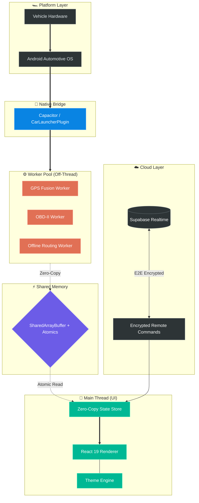
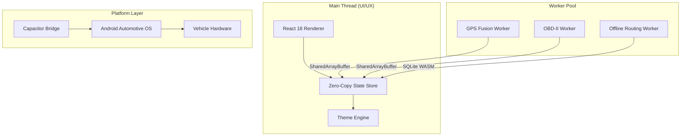

Built for Android Automotive OS with a worker-centric high performance runtime architecture.

# README.md

# Car Launcher Pro


Car Launcher Pro is an automotive-grade application runtime and high-performance dashboard designed for Android-based head units. Engineered as a robust middleware layer, it prioritizes deterministic performance, thermal stability, and low-latency sensor fusion for the modern vehicle environment.

---

## 🏎️ Vision & Philosophy

Modern automotive interfaces often suffer from UI jitter and thermal throttling due to inefficient resource management. Car Launcher Pro is built on the principle of Zero-Fluff Engineering. Every byte of memory and every CPU cycle is accounted for, ensuring that navigation, media, and vehicle telemetry remain fluid even under extreme hardware stress.

* Deterministic UI with 60FPS rendering targets
* Graceful degradation under thermal stress
* High-contrast, distraction-minimized UX
* Embedded-system-level performance optimization

---

## System Architecture

## Architecture Overview




## 🛠️ Advanced Engineering Systems

### Worker-Centric Architecture

The main UI thread is reserved exclusively for rendering. Heavy operations such as GPS parsing, OBD-II processing, and offline routing are executed inside dedicated workers.

### SharedArrayBuffer Optimization

Sub-millisecond synchronization between workers and UI is achieved using SharedArrayBuffer and Atomics to eliminate structured clone overhead.

## AI Engineering Workflow

This repository uses a multi-agent engineering workflow:

- Claude → deep refactoring and hardening
- Gemini → architecture and systems analysis
- Human review → final validation

All AI operations are governed by:
- `CLAUDE.md`
- `GEMINI.md`
- `AI.md`

### Predictive Thermal Management

The runtime proactively reduces rendering pressure and telemetry load before thermal throttling occurs.

* Dynamic map quality scaling
* GPS polling adaptation
* Background animation throttling
* Cache eviction under heat pressure

### Confidence-Based Sensor Fusion

The navigation engine combines multiple signal sources:

* GNSS positioning
* Accelerometer/Gyroscope trends
* Historical path prediction
* Dead reckoning logic

---

## 🏗️ Architecture Overview



---

## 🚀 Key Features

* Adaptive runtime management
* Predictive thermal systems
* Offline routing infrastructure
* Intelligent in-car UX
* Memory pressure monitoring
* Zero-copy UI pipeline
* Worker-based architecture
* SharedArrayBuffer state engine
* Automotive-grade resource balancing

---

## 💻 Tech Stack

* TypeScript 5.x
* React 18
* Capacitor
* SQLite WASM
* SharedArrayBuffer
* Web Workers
* Vitest
* Playwright

---

## 📂 Folder Structure

```txt
├── android/
├── public/
├── src/
│   ├── core/
│   ├── workers/
│   ├── store/
│   ├── components/
│   ├── hooks/
│   ├── types/
│   └── __tests__/
├── docs/
├── vite.config.ts
├── capacitor.config.ts
└── GEMINI.md
```

---

## 🔧 Installation

### Prerequisites

* Node.js 20+
* Android Studio
* Android SDK 34+

### Setup

```bash
git clone https://github.com/your-repo/car-launcher-pro.git
cd car-launcher-pro
npm install
npm run build
npx cap sync android
```

---

## 📈 Roadmap

* [x] SharedArrayBuffer integration
* [x] Predictive thermal engine
* [x] Worker orchestration layer
* [ ] CAN-bus integration
* [ ] AI-assisted driver intelligence
* [ ] Dynamic HUD support
* [ ] Advanced offline routing
* [ ] Vehicle telemetry AI analysis

---

## 🔒 Security & Reliability

* Fail-safe runtime degradation
* Thermal overload protection
* Offline-first infrastructure
* Deterministic rendering pipeline
* Memory pressure crash prevention
* Watchdog-based worker recovery

---

## 🤝 Contributing

Contributions from automotive engineers, embedded developers and performance enthusiasts are welcome.

1. Follow the Zero-Fluff Engineering philosophy
2. Include test coverage for all major changes
3. Keep performance impact minimal
4. Submit detailed pull request descriptions

---

## Technical Highlights

- SharedArrayBuffer + Atomics based zero-copy telemetry pipeline
- Worker-centric runtime architecture
- Thermal-aware adaptive rendering system
- CAN / OBD / GPS sensor fusion engine
- Tunnel dead reckoning navigation
- ECDH encrypted remote command system
- Automotive fail-safe runtime model
- Memory pressure aware degradation system

## Core Technologies

### SafeStorage Runtime

Automotive-grade persistence layer with atomic writes, adaptive throttling, dual-backend recovery and power-loss-safe transactions designed for unstable in-vehicle environments.

### Dead Reckoning Navigation

Tunnel-safe navigation system using GPS loss detection, heading blending, Haversine projection and uncertainty-aware position estimation for continuous navigation without live GPS signal.

### Zero-Trust Remote Command Engine

End-to-end encrypted remote vehicle command infrastructure using ECDH P-256, AES-256-GCM, replay-attack prevention and nonce-based validation.

### Adaptive Thermal Runtime

Thermal-aware workload scaling and graceful degradation system optimized for low-power Android Automotive hardware and Mali-class GPUs.

### Worker-Centric Telemetry Pipeline

SharedArrayBuffer + Atomics powered zero-copy telemetry architecture designed for low-latency UI updates and isolated heavy computation workloads.


## Automotive Constraints

CarosPro is engineered specifically for unstable automotive environments and low-power Android head units.

Unlike traditional mobile applications, the runtime is designed to survive real-world vehicle conditions such as:

* Sudden power loss
* Unstable voltage fluctuations
* Low-end ARM Mali GPUs
* Thermal throttling
* Weak eMMC endurance
* Intermittent GPS availability
* Abrupt process termination
* Long-term offline operation

The system prioritizes deterministic runtime behavior, graceful degradation and fail-safe recovery under constrained hardware conditions.

---

## SafeStorage Runtime

CarosPro includes a custom automotive-grade persistence layer called **SafeStorage**.

SafeStorage is responsible for protecting application integrity and storage reliability inside unstable in-vehicle environments.

### Core Capabilities

* Atomic write protection
* Power-loss-safe transactions
* eMMC wear reduction
* Adaptive write throttling
* Dual-backend persistence
* Self-healing recovery system
* Low-end hardware optimization
* Fail-safe storage recovery

### Why It Exists

Vehicle infotainment systems often run on low-cost eMMC storage with limited write endurance and unstable power delivery.

Traditional storage systems can corrupt application data during:

* ignition shutdown
* battery voltage drops
* abrupt Android process kills
* filesystem instability

SafeStorage prevents these failures through a layered persistence strategy.

### Runtime Strategy

1. Non-critical writes are throttled and buffered in memory.
2. Data is first written to temporary atomic files.
3. Integrity validation is performed before replacement.
4. Data is mirrored across Filesystem + LocalStorage.
5. Recovery systems automatically restore corrupted state sources.

### Engineering Goals

| Problem               | CarosPro Solution            |
| --------------------- | ---------------------------- |
| Sudden power loss     | Atomic temp-file persistence |
| Weak eMMC lifespan    | Adaptive write throttling    |
| Filesystem corruption | Dual-backend recovery        |
| Low-end GPU lag       | Runtime render degradation   |
| GPS signal loss       | Dead reckoning navigation    |
| Sensor instability    | Outlier filtering & fusion   |
| Thermal overload      | Adaptive workload scaling    |

SafeStorage is designed as a resilient persistence runtime optimized for automotive-grade reliability.

 
Distributed under the MIT License.

---

## 💡 Why Car Launcher Pro?

Most Android launchers are designed like standard mobile applications. Car Launcher Pro is engineered like a vehicle component.

The project prioritizes deterministic rendering, thermal resilience, embedded-system stability and intelligent runtime behavior to create a premium automotive experience optimized for real-world driving environments.

# Commit Message

feat: initialize professional project documentation
