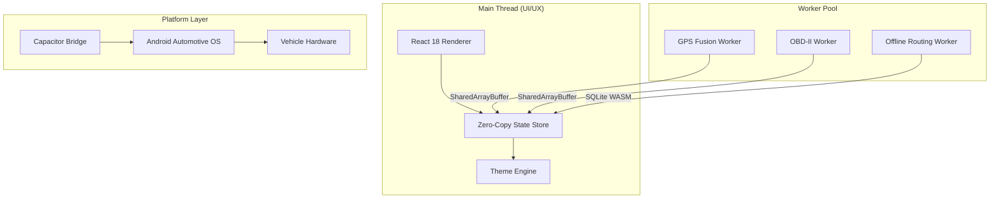

# README.md

# Car Launcher Pro


Car Launcher Pro is an automotive-grade application runtime and high-performance dashboard designed for Android-based head units. Engineered as a robust middleware layer, it prioritizes deterministic performance, thermal stability, and low-latency sensor fusion for the modern vehicle environment.

---

## 🏎️ Vision & Philosophy

Modern automotive interfaces often suffer from UI jitter and thermal throttling due to inefficient resource management. Car Launcher Pro is built on the principle of Zero-Fluff Engineering. Every byte of memory and every CPU cycle is accounted for, ensuring that navigation, media, and vehicle telemetry remain fluid even under extreme hardware stress.

* Deterministic UI with 60FPS rendering targets
* Graceful degradation under thermal stress
* High-contrast, distraction-minimized UX
* Embedded-system-level performance optimization

---

## 🛠️ Advanced Engineering Systems

### Worker-Centric Architecture

The main UI thread is reserved exclusively for rendering. Heavy operations such as GPS parsing, OBD-II processing, and offline routing are executed inside dedicated workers.

### SharedArrayBuffer Optimization

Sub-millisecond synchronization between workers and UI is achieved using SharedArrayBuffer and Atomics to eliminate structured clone overhead.

### Predictive Thermal Management

The runtime proactively reduces rendering pressure and telemetry load before thermal throttling occurs.

* Dynamic map quality scaling
* GPS polling adaptation
* Background animation throttling
* Cache eviction under heat pressure

### Confidence-Based Sensor Fusion

The navigation engine combines multiple signal sources:

* GNSS positioning
* Accelerometer/Gyroscope trends
* Historical path prediction
* Dead reckoning logic

---

## 🏗️ Architecture Overview



---

## 🚀 Key Features

* Adaptive runtime management
* Predictive thermal systems
* Offline routing infrastructure
* Intelligent in-car UX
* Memory pressure monitoring
* Zero-copy UI pipeline
* Worker-based architecture
* SharedArrayBuffer state engine
* Automotive-grade resource balancing

---

## 💻 Tech Stack

* TypeScript 5.x
* React 18
* Capacitor
* SQLite WASM
* SharedArrayBuffer
* Web Workers
* Vitest
* Playwright

---

## 📂 Folder Structure

```txt
├── android/
├── public/
├── src/
│   ├── core/
│   ├── workers/
│   ├── store/
│   ├── components/
│   ├── hooks/
│   ├── types/
│   └── __tests__/
├── docs/
├── vite.config.ts
├── capacitor.config.ts
└── GEMINI.md
```

---

## 🔧 Installation

### Prerequisites

* Node.js 20+
* Android Studio
* Android SDK 34+

### Setup

```bash
git clone https://github.com/your-repo/car-launcher-pro.git
cd car-launcher-pro
npm install
npm run build
npx cap sync android
```

---

## 📈 Roadmap

* [x] SharedArrayBuffer integration
* [x] Predictive thermal engine
* [x] Worker orchestration layer
* [ ] CAN-bus integration
* [ ] AI-assisted driver intelligence
* [ ] Dynamic HUD support
* [ ] Advanced offline routing
* [ ] Vehicle telemetry AI analysis

---

## 🔒 Security & Reliability

* Fail-safe runtime degradation
* Thermal overload protection
* Offline-first infrastructure
* Deterministic rendering pipeline
* Memory pressure crash prevention
* Watchdog-based worker recovery

---

## 🤝 Contributing

Contributions from automotive engineers, embedded developers and performance enthusiasts are welcome.

1. Follow the Zero-Fluff Engineering philosophy
2. Include test coverage for all major changes
3. Keep performance impact minimal
4. Submit detailed pull request descriptions

---
Sayın meslektaşım, CarosPro projesinin teknik anatomisi, modern otomotiv yazılım mühendisliği prensipleri üzerine inşa
  edilmiş, deterministik performans ve "fail-safe" çalışma modelini merkezine alan hibrit bir yapıdır.

  Aşağıda, sistemin mimari derinliğini senior architect seviyesinde analiz eden teknik döküm yer almaktadır.

  ---

  1. Sistem Mimarisi ve Topoloji (The Hybrid Core)
  CarosPro, tek bir "monolitik" web uygulaması değil, Distributed System prensibiyle çalışan bir çalışma zamanı
  (runtime) ekosistemidir.

   * Layer 1 (UI/UX): React 19 (Concurrent Mode) + CSS Variable Engine. UI katmanı sadece "presentational" state'i
     yönetir; ağır veriyi işlemez.
   * Layer 2 (Core Computation): Web Worker tabanlı VehicleCompute. Tüm sensör füzyonu, mesafe hesaplamaları ve event
     detection bu izole thread'de gerçekleşir.
   * Layer 3 (Hardware Bridge): Capacitor tabanlı native eklentiler. Android Automotive OS (AAOS) ve araç CAN-Bus hattı
     ile CarLauncherPlugin üzerinden haberleşir.
   * Layer 4 (Backend/Cloud): Supabase (PostgreSQL + Realtime). Komut zinciri ve telemetri için E2E şifreli bir backbone
     görevi görür.

  ---

  2. Worker & Thread Modeli (Zero-Copy Data Pipeline)
  Projenin en kritik inovasyonu, ana thread'i (UI) I/O yükünden tamamen kurtaran SharedArrayBuffer (SAB) mimarisidir.

   * Shared Memory: Sensör verileri (Speed, RPM, Fuel) bir SharedArrayBuffer üzerinde ham binary olarak tutulur.
   * Atomics: Worker, veriyi güncellediğinde Atomics.store ile bir "generation counter" artırır. UI tarafındaki Gauge
     bileşenleri, React render döngüsüne girmeden, requestAnimationFrame (RAF) içinde bu counter'ı kontrol eder. Eğer
     counter değişmişse, Float64Array üzerinden veriyi doğrudan okur.
   * Neden? Bu yöntem, binlerce sensör güncellemesinin yarattığı "Structured Clone" maliyetini (postMessage overhead)
     sıfıra indirir ve düşük donanımlı (Mali-400 GPU gibi) ünitelerde bile 60 FPS akıcılık sağlar.

  ---

  3. Adaptive Runtime & Thermal Intelligence
  Sistem, donanım sağlığına göre kendini dinamik olarak yeniden yapılandıran bir State-Aware Engine'e sahiptir.

   * Hysteresis Modeli: Sıcaklık veya RAM baskısı oluştuğunda sistem anında "Downgrade" (ör. Performance -> Basic JS)
     yapar. Ancak "Upgrade" işlemi, sistemin stabil olduğunu doğrulamak için 30 saniyelik bir bekleme penceresine
     (UPGRADE_DELAY_MS) sahiptir.
   * Thermal Watchdog: L1, L2 ve L3 seviyelerinde throttling uygular.
       * L1 (45°C): Harita FPS'i düşürülür.
       * L2 (55°C): Parlaklık %50'ye kilitlenir, ağır arka plan senkronizasyonları durdurulur.
       * L3 (65°C): "Minimum Load" modu. Sadece kritik navigasyon ve hız göstergesi çalışır.
   * GPU Guard: --rt-blur CSS değişkeni üzerinden, eski GPU'ları zorlayan backdrop-filter: blur efektleri tek bir global
     switch ile devre dışı bırakılır.

  ---

  4. Sensör Füzyonu ve Navigasyon Pipeline
  Hız ve konum verisi, Priority-based Fusion algoritmasıyla işlenir.

   * Hız Hiyerarşisi: CAN Bus > OBD-II > GPS. CAN verisi geliyorsa en güvenilir odur. OBD ve GPS arasında 15 km/h'den
     fazla fark oluşursa (Plausibility Check), sistem sensör hatası tespit eder ve güven skoru yüksek olan kaynağa
     (genelde GPS) fallback yapar.
   * Dead Reckoning (Tünel Modu): GPS sinyali koptuğunda, son bilinen hız ve vektör üzerinden Haversine projeksiyonu ile
     araç konumu 45 saniyeye kadar tahmin edilmeye devam edilir.
   * Navigation O(W) Search: 500 km'lik bir rotada mesafe hesaplamak CPU maliyetlidir. CarosPro, rota geometrisi
     üzerinde bir "Windowed Search" (O(W)) yaparak sadece aracın 1.5 km önündeki segmentleri tarar, bu da hesaplama
     maliyetini sabit tutar.
   * Visual Snapping: Araç marker'ı, ham GPS koordinatına değil, rota üzerindeki en yakın segmente "snap" edilir.
     Böylece haritada ikonun yoldan kayması engellenir (Reroute threshold: 35m).

  ---

  5. Audio / DSP Engine (Crystal Cabin v3)
  Web Audio API üzerinde koşan tam kapsamlı bir sinyal zinciri (signal chain) mevcuttur.

   * Signal Chain: Source -> 10-band EQ -> DynamicsCompressor (AGC) -> Haas Delay -> Panner -> Master Gain.
   * Speed Volume Compensation (SVC): Aracın hızına göre (40-120 km/h arası) sesi lineer dB rampasıyla artırır. 3
     km/h'lik bir Schmidt Trigger histerezisi ile anlık hız dalgalanmalarının seste titreme yapması önlenir.
   * ISO 22262 Audio Ducking: Navigasyon anonsu başladığında müzik %30 seviyesine (DUCK_LEVEL) "exponential ramp" ile
     indirilir ve anons bitince yumuşak bir şekilde geri yükseltilir.

  ---

  6. Güvenlik Modeli (Zero-Trust Remote Command)
  Araç komutları (kapı kilidi, korna vb.) Supabase üzerinden geçerken asla "plaintext" değildir.

   * ECDH (P-256) Encryption: Araç ve telefon arasında asimetrik anahtar değişimi yapılır. Supabase sadece şifreli
     (base64) ciphertext'i görür.
   * Anti-Replay: Her komut bir _ts (timestamp) ve _nonce içerir. Araç, daha önce gördüğü veya 30 saniyeden eski olan
     komutları şifreyi çözmeden reddeder.
   * Hardware ACK: Komut icra edildiğinde, native katmandan donanım onayı (ACK) beklenir. 500ms içinde ACK gelmezse
     komut "Rejected" sayılır.

  ---

  7. Veri Bütünlüğü ve Fail-Safe
   * eMMC Yazma Koruması: Otomotiv ünitelerindeki eMMC ömrünü korumak için tüm depolama işlemleri (Settings, Odometer) 4
     saniyelik bir debounce (throttledStorage) ile yazılır.
   * Odometer Guard: GPS sıçramalarını (jump) engellemek için her okuma bir "Velocity-Time Check"ten geçer. Işık hızında
     (mantıksız) hareketler odometer'a yansımaz.
   * Memory Pressure Management: Android onTrimMemory sinyali alındığında, sistem "Optional" olan worker'ları (Vision,
     Radar) sonlandırır ve cache'leri temizleyerek kritik fonksiyonların (Navigation, Speed) hayatta kalmasını sağlar.

  ---

  8. Gelecek Roadmap
   * VAL (Vehicle Abstraction Layer) Genişlemesi: J2534 ve ELM327 sürücülerinin native katmanda standartlaştırılması.
   * Vision AR Integration: Three.js üzerinden şerit takip ve sanal navigasyon oklarının (AR HUD) entegrasyonu.
   * Predictive Maintenance: OBD verileri üzerinden ML tabanlı arıza kestirimi.

  Bu mimari, CarosPro'yu basit bir dashboard'dan öteye taşıyıp, gerçek bir Automotive Compute Platform haline
  getirmektedir. Her teknik karar, sürüş güvenliğini ve sistem kararlılığını önceler.

## 📄 License

Distributed under the MIT License.

---

## 💡 Why Car Launcher Pro?

Most Android launchers are designed like standard mobile applications. Car Launcher Pro is engineered like a vehicle component.

The project prioritizes deterministic rendering, thermal resilience, embedded-system stability and intelligent runtime behavior to create a premium automotive experience optimized for real-world driving environments.

# Commit Message

feat: initialize professional project documentation
