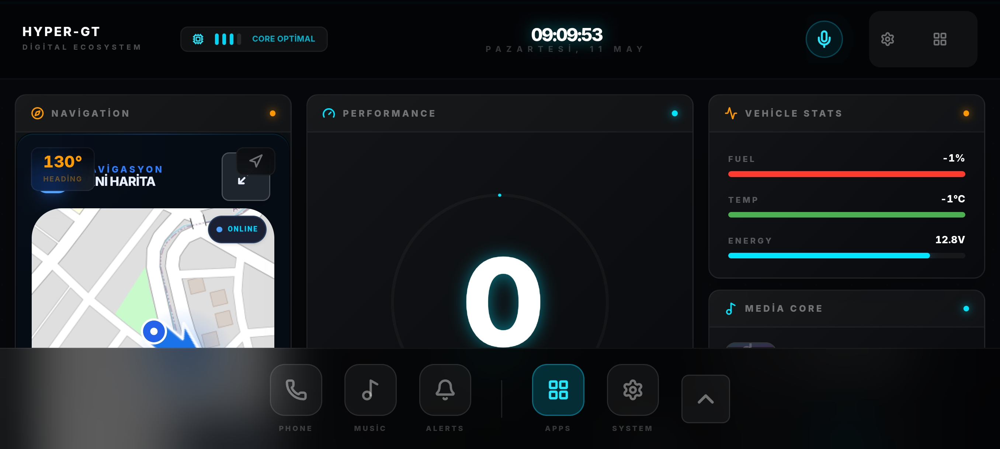
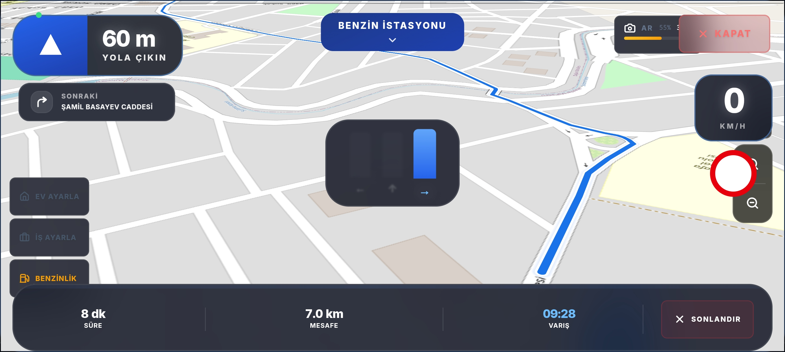

# CarOS Pro (CockpitOS)

[](LICENSE-PROPRIETARY.md)


Android tabanlı araç head-unit'leri için **Vehicle Intelligence OS**. Navigasyon, medya,
araç telemetrisi (OBD-II / CAN), sesli asistan ve araç durumu tek bir çalışma zamanında
birleşir. Düşük güçlü head-unit donanımında deterministik render ve termal kararlılık
hedeflenerek geliştirilir.

> Bu depo **tescilli / kapalı kaynak** ticari yazılımdır. Ayrıntı: [LICENSE-PROPRIETARY.md](LICENSE-PROPRIETARY.md).

---

## Ekran görüntüleri


*Ana ekran — navigasyon, performans göstergeleri, araç durumu*


*Tam ekran navigasyon*

---

## Mimari özet

- **Worker-centric çalışma zamanı** — GPS füzyonu, OBD-II işleme ve offline routing ayrı
  Web Worker'larda; ana thread render için ayrılır.
- **SharedArrayBuffer + Atomics** — worker ↔ UI arasında zero-copy telemetri aktarımı
  (SAB kullanılamayan ortamda düşüş yolu vardır; bkz. `docs/adr/0005-sab-crossoriginisolation-runtime-ceiling.md`).
- **Adaptive runtime** — cihaz katmanına göre FPS/telemetri bütçesi, termal ve bellek
  baskısında kademeli render düşürme.
- **Kanonik truth sahipliği** — her domain kendi truth'unun tek sahibidir; UI bir
  projeksiyondur, domain truth üretmez.
- **Native köprü** — Capacitor + `CarLauncherPlugin` üzerinden Android head-unit yetenekleri.

Mimarinin kanonik anlatımı README'de değil, domain belgelerindedir (aşağıya bkz.).

---

## Teknoloji

| Katman | Teknoloji |
|-------|-----------|
| Arayüz | React 19, TypeScript 5 |
| Build | Vite |
| Stil | Tailwind CSS 4 |
| State | Zustand 5 |
| Harita | MapLibre GL (offline-first) |
| Mobil | Capacitor (Android) |
| Depolama | SQLite WASM + SafeStorage |
| Eşzamanlılık | Web Workers, SharedArrayBuffer + Atomics |

---

## Klasör yapısı

```
src/
├── core/              # Çalışma zamanı çekirdeği (VAL, adaptive runtime)
├── components/        # Özellik bazlı UI bileşenleri
├── platform/          # Native köprü ve platform servisleri
├── store/             # Zustand state dilimleri
├── hooks/             # React hook'ları
├── types/             # TypeScript tipleri
└── __tests__/         # Birim ve entegrasyon testleri
android/               # Capacitor Android projesi
public/maps/           # Offline harita verisi
supabase/              # Veritabanı migration'ları
docs/                  # Kanonik belgeler + arşiv
field-runs/            # Gerçek cihaz/saha kanıtları (ham)
```

---

## Kurulum

Gereksinimler: Node.js 20+, Android Studio, Android SDK 34+.

```bash
git clone https://github.com/selimmujdeci/Car-launcher-pro.git
cd Car-launcher-pro
npm install
npm run build
npx cap sync android
```

Release APK yalnız release sürecinde alınır: `docs/operations/RELEASE_CHECKLIST.md`.

---

## Belgeler

| Alan | Belge |
|---|---|
| AI/geliştirme çalışma kuralı | [CLAUDE.md](CLAUDE.md) |
| Ürün vizyonu | `docs/CAROS_PRO_VIZYONU.md` |
| Saha doğrulama kütüğü | `docs/DEVICE_VALIDATION_LEDGER.md` |
| Mimari | `docs/architecture/` |
| Navigasyon | `docs/navigation/` |
| Mavi (asistan) | `docs/mavi/` |
| Müzik/medya | `docs/music/` |
| OBD/CAN | `docs/obd-can/` |
| Güvenlik | `docs/security/` · [SECURITY.md](SECURITY.md) |
| Operasyon/release | `docs/operations/` |
| Mimari kararlar (ADR) | `docs/adr/` |
| Tarihsel kayıt | `docs/archive/`, `docs/field/` |

---

## Katkı ve güvenlik

- Katkı kuralları: [CONTRIBUTING.md](CONTRIBUTING.md)
- Davranış kuralları: [CODE_OF_CONDUCT.md](CODE_OF_CONDUCT.md)
- Güvenlik açığı bildirimi: [SECURITY.md](SECURITY.md)

---

## Lisans

Bu depo **proprietary (tescilli), closed-source / kapalı kaynak** ticari yazılımdır ve
açık kaynak lisansı altında dağıtılmaz. Tüm kullanım, kopyalama, değiştirme, dağıtım ve
ticari haklar yalnızca [LICENSE-PROPRIETARY.md](LICENSE-PROPRIETARY.md) ile yönetilir.
Depoya erişim herhangi bir mülkiyet veya lisans hakkı vermez.
