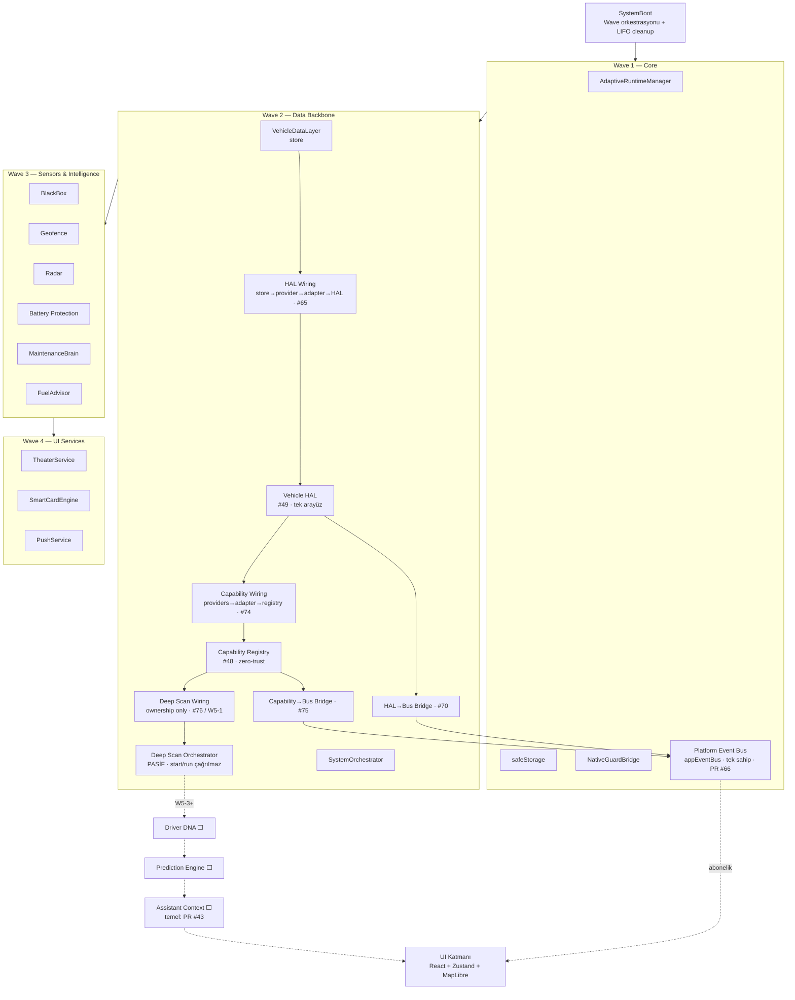

# CarOS Pro — ARCHITECTURE (canlı mimari)

> Her merge sonrası güncellenir. Kaynak: `src/platform/system/SystemBoot.ts` + wiring dosyaları.
> **Son güncelleme:** 2026-07-12 (main `86d6087`, W5-1 sonrası).

---

## Platform Core zinciri (kuzeyden güneye)

---

## Katman durumları

| Katman | Durum | Not |
|--------|-------|-----|
| SystemBoot | LIVE | Wave 1–4, LIFO cleanup (Wave 4→1) |
| Platform Event Bus | LIVE | Tek sahip singleton, boot başına 1 bus |
| Vehicle HAL | LIVE | Store→provider→adapter→HAL ayna modu; fail-closed kaynak kaybı |
| Capability Registry | LIVE | Zero-trust; yan-etkisiz browser-API + deviceTier kanıtı |
| Deep Scan | **FOUNDATION ONLY** | W5-1 ownership bağlı; `start()/run()` YOK → tarama başlamaz |
| Driver DNA | NOT ACTIVE | Phase C |
| Prediction | NOT ACTIVE | Phase C |
| Assistant Context | NOT ACTIVE | Temel PR #43 MERGED (Ledger #28 🔴) |

---

## Kritik sözleşmeler

- **Ownership:** Wiring oluşturduğunu sahiplenir; paylaşılan singleton (runtime/persistence/ignition/bus) **dispose edilmez** (bkz. `PROJECT_MEMORY.md`).
- **Fail-closed:** Deep Scan `ignitionConfirmed = null` kaynak yokken; aktif fazlar `waiting_for_ignition`'da bloke.
- **Event akışı:** Değişiklik-only ingest (O(1)); batch ingest N→1 emit; transient event history'yi şişirmez.
- **Zero-leak:** Her `_reg(fn)` bir dispose garantisi; LIFO sırada çalışır.
- **Bridge yön:** Kaynak katman → Bus (tek yön); Bus, katmanları başlatmaz/durdurmaz (DI ile publisher tüketir).

---

## Boot Wave özeti (`SystemBoot.ts`)

| Wave | İçerik |
|------|--------|
| Wave 1 (Core) | runtimeManager · safeStorage · NativeGuardBridge · EventBus wiring · crash recovery |
| Wave 2 (Backbone) | VehicleDataLayer · HAL wiring · HAL bridge · Capability wiring · Capability bridge · Deep Scan wiring · SystemOrchestrator |
| Wave 3 (Intelligence) | MaintenanceBrain · FuelAdvisor · BlackBox · Geofence · Radar · Battery |
| Wave 4 (UI Services) | TheaterService · SmartCardEngine · PushService |
